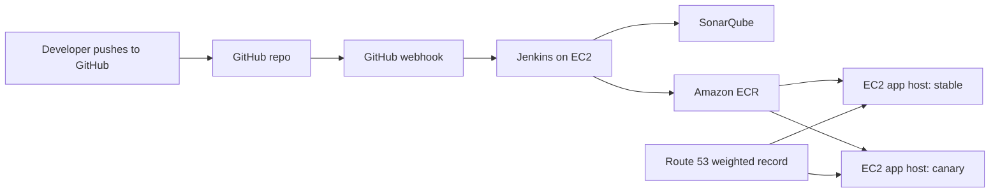

# Jenkins Microservices CI/CD Demo

This repo is a ready-to-push demo for a Jenkins pipeline with GitHub as the source, Jenkins on EC2, SonarQube quality checks, unit/smoke tests, Docker images in Amazon ECR, Route 53 DNS, and a two-EC2 canary deployment.

## What This Demonstrates

- GitHub push triggers a Jenkins Pipeline job.
- Jenkins builds different app types from one pipeline:
  - Spring Boot with Maven
  - Node/Express
  - Static HTML/CSS through Nginx
- Unit tests, SonarQube analysis, quality gate, Docker build, smoke test, and ECR push.
- Deployment to two EC2 app hosts:
  - stable host
  - canary host
- Route 53 weighted DNS for canary traffic splitting.

## Architecture



## Repo Layout

```text
.
├── Jenkinsfile
├── services/
│   ├── springboot-api/
│   ├── node-api/
│   └── static-site/
├── deploy/scripts/
│   ├── bootstrap_app_ec2_amazon_linux.sh
│   ├── deploy_ec2.sh
│   └── update_route53_weighted.sh
├── infra/
│   ├── aws/iam/jenkins-policy.json
│   └── jenkins/
└── docs/
    ├── demo-walkthrough.md
    └── jenkins-ec2-setup.md
```

## Jenkins Job Parameters

The `Jenkinsfile` exposes these important parameters:

- `SERVICE`: `changed`, `all`, `springboot-api`, `node-api`, or `static-site`
- `DEPLOY_MODE`: `none`, `stable`, or `canary`
- `CANARY_WEIGHT`: percentage of Route 53 DNS traffic sent to canary
- `AWS_REGION`: AWS region for ECR and Route 53 calls
- `ECR_REPO_PREFIX`: ECR namespace prefix, default `jenkins-demo`
- `PUBLIC_PORT`: public port on each app EC2 host, default `80`

For a clean deployment demo, build one service at a time, for example:

```text
SERVICE=node-api
DEPLOY_MODE=canary
CANARY_WEIGHT=10
```

## Jenkins Credentials To Create

Create these credentials in Jenkins before running deployment:

| Credential ID | Type | Example value |
| --- | --- | --- |
| `app-ec2-ssh-key` | SSH username with private key | `ec2-user` and your app EC2 private key |
| `stable-host` | Secret text | Public DNS or IP of stable EC2 |
| `canary-host` | Secret text | Public DNS or IP of canary EC2 |
| `stable-target` | Secret text | DNS target for stable weighted record |
| `canary-target` | Secret text | DNS target for canary weighted record |
| `route53-hosted-zone-id` | Secret text | Hosted zone ID |
| `route53-record-name` | Secret text | Example: `app.example.com` |

Use an IAM instance profile on the Jenkins EC2 instance with the policy in `infra/aws/iam/jenkins-policy.json`.

## Quick Demo Flow

1. Push this repo to GitHub.
2. Start Jenkins and SonarQube on an EC2 instance using `infra/jenkins`.
3. Create a Jenkins Pipeline or Multibranch Pipeline job pointing to the GitHub repo.
4. Add a GitHub webhook:

```text
http://JENKINS_PUBLIC_DNS_OR_IP:8080/github-webhook/
```

5. Run the pipeline manually once with `SERVICE=node-api` and `DEPLOY_MODE=stable`.
6. Run again with `DEPLOY_MODE=canary` and `CANARY_WEIGHT=10`.
7. Make a small code change, commit, and push. GitHub triggers the pipeline automatically.

Detailed steps are in `docs/demo-walkthrough.md`.

